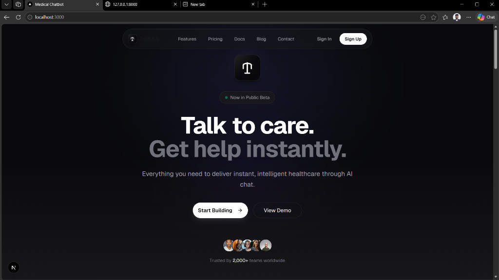
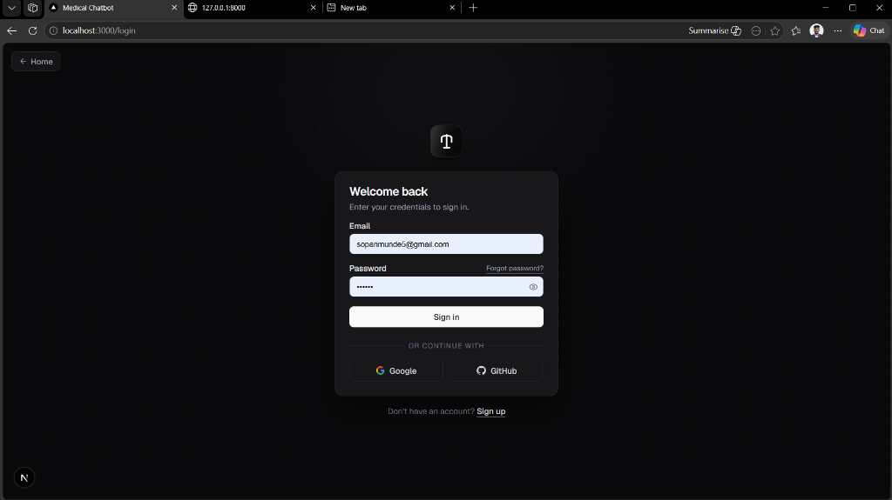
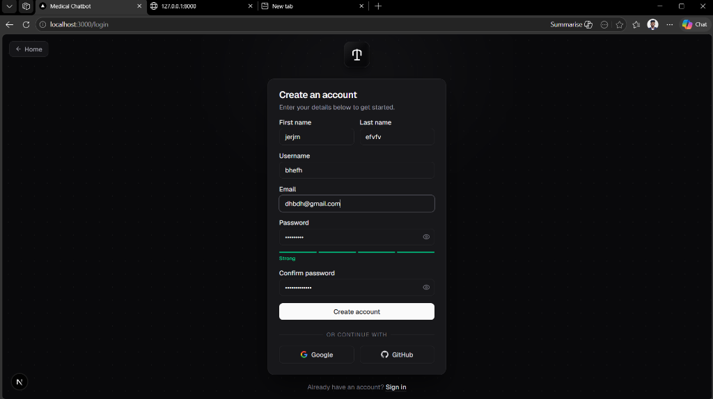
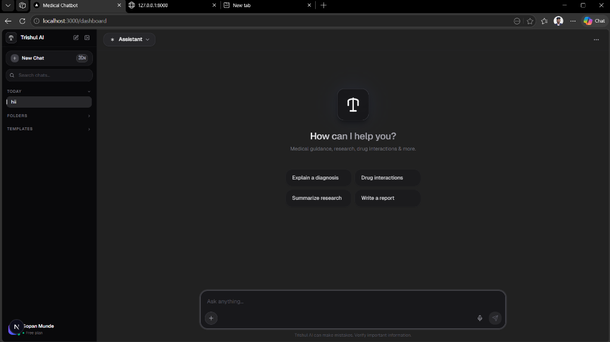
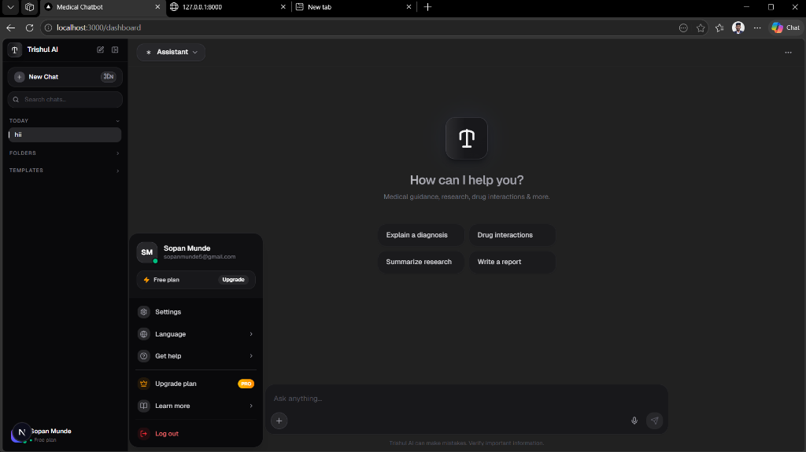
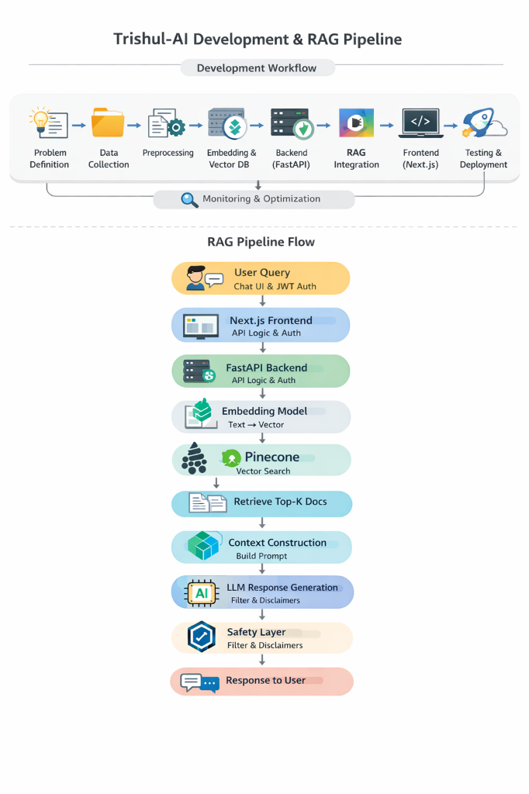

# 🩺 Trishul-AI: AI-Powered Medical Chatbot

An intelligent, context-aware medical chatbot built using a **Retrieval-Augmented Generation (RAG)** pipeline. Trishul-AI retrieves contextually relevant medical facts from a vector database and uses Large Language Models (LLMs) to synthesize safe, non-diagnostic answers. It features a responsive, premium user interface with user authentication, custom conversation management, templates, and folder structures.

---

## 📸 System Screenshots

### 🌐 Landing Page
<div align="center">
  
</div>

### 🔑 Authentication (Sign In & Register)
<div align="center">
  <table>
    <tr>
      <td align="center"><b>Sign In</b></td>
      <td align="center"><b>Create Account</b></td>
    </tr>
    <tr>
      <td></td>
      <td></td>
    </tr>
  </table>
</div>

### 💬 Chat Assistant Dashboard
<div align="center">
  
</div>

### 👤 Profile & Context Options
<div align="center">
  
</div>

---

## 🧠 Project Architecture & Workflow

Trishul-AI utilizes a modern hybrid architecture separating vector search retrieval, document chunk storage, fast microservice endpoints, and a responsive frontend dashboard.

### 🔄 RAG Pipeline Flowchart
<div align="center">
  
</div>

### 🏗️ Technical Architecture Diagram

```
                 +-------------------------------------------------------+
                 |                       FRONTEND                        |
                 |                       (Next.js)                       |
                 +---------------------------+---------------------------+
                                             |
                                   HTTP API & SSE Stream
                                             v
                 +-------------------------------------------------------+
                 |                        BACKEND                        |
                 |                   (FastAPI / Python)                  |
                 +-------+-------------------+-------------------+-------+
                         |                   |                   |
                         v                   v                   v
                 +---------------+   +---------------+   +---------------+
                 |  MongoDB DB   |   |   LangChain   |   |   HuggingFace |
                 | (Users, Chats |   |  Orchestrator |   |   Embeddings  |
                 | & Templates)  |   +-------+-------+   | (MiniLM-L6-v2)|
                 +---------------+           |           +-------+-------+
                                             v                   |
                                     Document Context            | Query Vectors
                                             v                   v
                                     +---------------+-----------+---+
                                     |   Pinecone Vector Database    |
                                     |       (Trishul-AI Index)      |
                                     +---------------+---------------+
                                                     |
                                            Synthesis Generation
                                                     v
                                             +-------+-------+
                                             |  Google GenAI |
                                             | (Gemini-2.5)  |
                                             +---------------+
```

### 🔄 End-to-End Execution Flow
1. **Query Submission**: The user enters a question into the `Composer` component on the Next.js frontend.
2. **API Dispatch**: The query is sent as a POST request to `/api/chat` with JWT bearer authorization headers.
3. **Query Embedding**: The FastAPI server receives the query and generates its semantic embedding vector using `sentence-transformers/all-MiniLM-L6-v2`.
4. **Context Retrieval**: LangChain retrieves the top-K (~3) matching chunks from the `trishul-ai` vector index in Pinecone.
5. **Prompt Injection**: The retrieved text chunks are combined with a system prompt template containing safety constraints, context definitions, and formatting rules.
6. **Streaming Generation**: The prompt is processed by the Google GenAI SDK (`gemini-2.5-flash`) via LangChain, streaming the generated assistant response back to the client via Server-Sent Events (SSE).
7. **Chat Persistence**: The client updates the conversation thread in real-time, saving the message logs in MongoDB.

---

## 🛠️ Tech Stack & Dependencies

### 🤖 Artificial Intelligence & RAG
- **Orchestration**: LangChain, LangChain Core, LangChain Community
- **LLM Engine**: Google GenAI (`gemini-2.5-flash`)
- **Embeddings**: HuggingFace Sentence-Transformers (`all-MiniLM-L6-v2`)
- **Vector DB**: Pinecone Serverless (AWS `us-east-1` spec)

### ⚡ Backend Server
- **Framework**: FastAPI (Python)
- **ASGI Server**: Uvicorn
- **Security**: JWT tokens, bcrypt pass hashing, Python-Jose (for authentication)
- **Async Client**: Motor (MongoDB Async Driver) & HTTPX

### 💻 Frontend Client
- **Framework**: Next.js 15 (React 19 & TypeScript)
- **Styling**: TailwindCSS & Framer Motion
- **Markdown Handling**: ReactMarkdown, RehypeHighlight, RemarkGfm
- **Icons**: Lucide React
- **Lock & Package Manager**: Bun

---

## ⚙️ Installation & Development Setup

### 1️⃣ Clone the Repository
```bash
git clone https://github.com/sopanmunde/Trishul_AI.git
cd Trishul_AI
```

### 2️⃣ Backend Configuration (FastAPI)
1. **Navigate to backend and install requirements**:
   ```bash
   cd api
   pip install -r requirements.txt
   ```
2. **Create a `.env` file inside the `api/` directory**:
   ```env
   GOOGLE_API_KEY=your_google_gemini_api_key
   PINECONE_API_KEY=your_pinecone_vector_db_api_key
   MONGODB_URL=mongodb+srv://...your_mongodb_uri
   DATABASE_NAME=trishul_db
   SECRET_KEY=your_jwt_signing_secret_key
   ACCESS_TOKEN_EXPIRE_MINUTES=1440
   ```
3. **Populate Pinecone Vector Index**:
   Ensure you have PDF files placed inside `api/data/` folder, then run the indexing pipeline script:
   ```bash
   python store_index.py
   ```
4. **Start Backend API Dev Server**:
   ```bash
   python index.py
   ```
   *The server runs locally at: `http://127.0.0.1:8000`*

### 3️⃣ Frontend Configuration (Next.js)
1. **Navigate to frontend and install node packages**:
   ```bash
   cd ../frontend
   bun install
   ```
2. **Create a `.env` file inside the `frontend/` directory**:
   ```env
   NEXT_PUBLIC_API_BASE_URL=http://127.0.0.1:8000
   ```
3. **Start Frontend Client Server**:
   ```bash
   bun dev
   ```
   *Open browser client at: `http://localhost:3000`*

---

## 🩺 Medical & Safety Disclaimer

Trishul-AI is a prototype designed to demonstrate Retrieval-Augmented Generation capabilities in the healthcare space. Responses are provided for information retrieval purposes only and **do not constitute professional medical advice, diagnosis, or treatment**. Always seek the advice of your physician or qualified health provider with any questions you may have regarding medical conditions.

---

## ☁️ Azure Cloud Deployment

The backend service is configured to deploy to **Azure App Service** using **GitHub Actions**.

### 1️⃣ Azure Infrastructure Setup (Azure CLI)
1. **Log in to Azure**:
   ```bash
   az login
   ```
2. **Create a Resource Group**:
   ```bash
   az group create --name trishul-ai-rg --location EastUS
   ```
3. **Create an App Service Plan** (B1 tier recommended to support local HuggingFace embeddings memory requirement):
   ```bash
   az appservice plan create --name trishul-ai-plan --resource-group trishul-ai-rg --sku B1 --is-linux
   ```
4. **Create the Web App**:
   ```bash
   az webapp create --name trishul-ai-backend --resource-group trishul-ai-rg --plan trishul-ai-plan --runtime "PYTHON:3.12"
   ```

### 2️⃣ Azure Web App Configuration
Configure the startup command and environment variables in the Azure Portal or via Azure CLI.

* **Startup Command**: `gunicorn -w 2 -k uvicorn.workers.UvicornWorker index:app`
* **Application Settings (Environment Variables)**:
  - `SCM_DO_BUILD_DURING_DEPLOYMENT` = `true` (enables pip dependency installation)
  - `MONGODB_URL` = `your_mongodb_atlas_connection_string`
  - `DATABASE_NAME` = `trishul_db`
  - `PINECONE_API_KEY` = `your_pinecone_api_key`
  - `PINECONE_INDEX_NAME` = `trishul-ai`
  - `GOOGLE_API_KEY` = `your_google_gemini_api_key`
  - `SECRET_KEY` = `your_jwt_secret_key`
  - `ALGORITHM` = `HS256`
  - `ACCESS_TOKEN_EXPIRE_MINUTES` = `30`
  - `FRONTEND_URL` = `your_vercel_frontend_url`

### 3️⃣ CI/CD GitHub Actions Setup
1. In the **Azure Portal**, navigate to your Web App, click **Get publish profile** on the overview page, and download the `.PublishSettings` file.
2. In your **GitHub Repository**, go to **Settings > Secrets and variables > Actions** and add a repository secret:
   - **Name**: `AZURE_WEBAPP_PUBLISH_PROFILE`
   - **Value**: (Paste the contents of the downloaded settings file)
3. Push changes to the `main` branch. GitHub Actions will automatically zip, upload, and deploy the `api/` directory.

